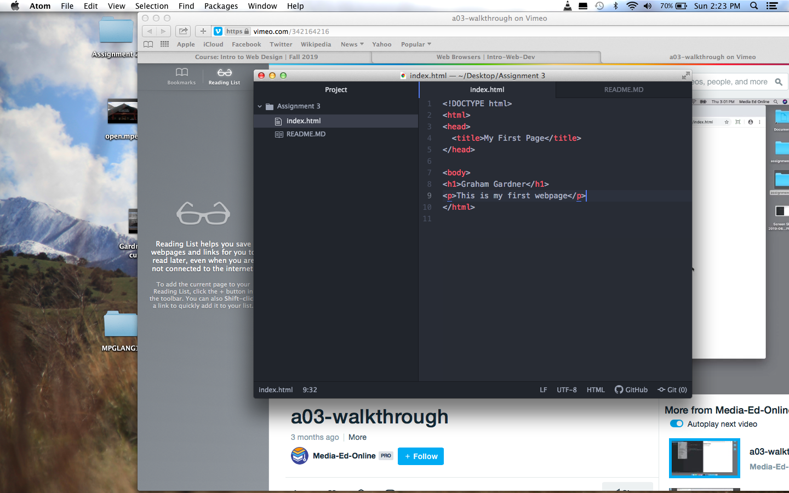

Browsers work to find and retrieve information on the web. I currently use google chrome and safari
Markup language controls the architecture of a page with a main focus on its text content one common one used is Hypertext Markup Language or HTML

